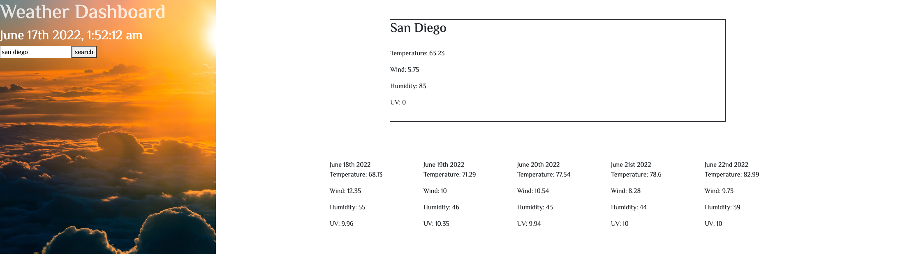

# weather-app
***
This app lets the user search for weather information within the United States. It provides temperature, humidity, wind speed, and UV information. The local storage saves recent searches which the user can click on to view the weather information. I used the Open Weather One Call API to get the longitude and latitude  information which then gave me the weather information for the city. The app also provides a five day forecast with the current time and date. Learning how to display the five day forecast and search history was a challenge. 

***
site: https://armando1236.github.io/weather-app/
Github: https://github.com/armando1236/weather-app.git
***
I used JavaScript, HTML, CSS, BootStrap, and jQuery on Visual Studio Code.
***
